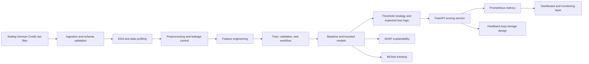

# Architecture

## System Intent

This project is designed as a business-grade analytical product rather than a notebook-only exercise.

## Key Design Principles

- separate EDA from preprocessing and modeling
- avoid target leakage across joined credit tables
- keep reproducible training and scoring contracts
- support both analysts and non-technical stakeholders
- design for observability from the beginning
